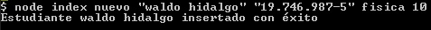

# Proyecto Always Music v2

Este repositorio contiene el código solución al segundo desafío **Always Music v2** del módulo 7 llamado **Acceso a datos en aplicaciones Node** de la beca Desarrollo de aplicaciones Full Stack Javascript Trainee dictado por Desafío Latam.

## Requisitos


## Diagrama de Flujo del Proyecto vía screenshots

### 1-Agregar un nuevo estudiante

Puedo agregar un nuevo estudiante usando el siguiente comando:



Si faltara algún parámetro para crear un nuevo estudiante se genera el siguiente mensaje:


### 2-Consulta de todos los estudiantes registrados

Para consultar todos los estudiantes registrados ejecuto el siguiente comando:


### 3-Consultar estudiante por rut

Para consultar un estudiante ejecuto el siguiente comando para el rut **'19.746.987-5'**:


### 4-Actualizar la información de un estudiante

Para editar los datos para el rut **'19.746.987-5'** ingreso el siguiente comando en la consola:


Si falta algún parámetro muestro el siguiente mensaje en la consola:


### 5-Eliminar el registro de un estudiante

Para eliminar un estudiante ingreso el siguiente comando para eliminar el registro con el rut **'17.458.987-5'**:


Si ejecuto el comando eliminar sin parámetro entonces se muestra el siguiente mensaje:


Si ejecuto el comando eliminar con un rut que no existe entonces se muestra el siguiente mensaje:


## Soluciones

### 1.Hacer todas las consultas con un JSON como argumento del método query.(2 Puntos)

### 2.Hacer las consultas con texto parametrizado.(3 Puntos)

### 3.Capturar los posibles errores en todas las consultas e imprimirlos por consola.(3 Puntos)

### 4.Obtener el registro de los estudiantes registrados en formato de arreglos. (3 Puntos)

A continuación muestro la clase que he creado en la cual incorporo los requisitos pedidos. Como se puede observar en los 5 métodos asíncronos **ingresarEstudiante**, **consultarPorRut**, **consultarTodosLosEstudiantes**, **editarEstudiante** y **eliminarEstudiantePorRut** realizo las consultas con un objeto **query**, las consultas estan parametrizadas, capturo los errores mediante uso del bloque try y catch, y muestro data en forma de array cuando consulto a la base de datos.

```js
export default class Conexion {
  constructor(arrayComandos, pool) {
    this.arrayComandos = arrayComandos;
    this.pool = pool;
  }
  async ingresarEstudiante() {
    const argumentosData = this.arrayComandos.slice(1);

    if (argumentosData.length === 4) {
      const estudiante = {
        nombre: argumentosData[0],
        rut: argumentosData[1],
        curso: argumentosData[2],
        nivel: argumentosData[3],
      };

      try {
        const query = {
          text: "insert into estudiantes (nombre,rut,curso,nivel) values ($1, $2,$3, $4)",
          values: [
            estudiante.nombre,
            estudiante.rut,
            estudiante.curso,
            estudiante.nivel,
          ],
        };

        const response = await this.pool.query(query);

        if (response.rowCount == 1) {
          console.log(`Estudiante ${estudiante.nombre} insertado con éxito`);
        }
      } catch (error) {
        console.log(
          `Error Code: ${error.code}, Error Message: ${error.message}`,
        );
      }
    } else {
      console.log(
        `Falta(n) los siguientes parámetros: ${
          argumentosData[0] ? "" : "nombre,"
        } ${argumentosData[1] ? "" : "rut,"} ${
          argumentosData[2] ? "" : "curso,"
        } ${argumentosData[3] ? "" : "nivel"}`,
      );
    }
  }
  async consultarPorRut() {
    const argumentosData = this.arrayComandos.slice(1);
    if (argumentosData[0]) {
      const rut = argumentosData[0];
      try {
        const query = {
          text: "select * from estudiantes where rut = $1",
          values: [rut],
          rowMode: "array",
        };

        const response = await this.pool.query(query);
        if (response.rowCount == 0) {
          console.log("Estudiante no encontrado");
        } else {
          console.log(response.rows);
        }
      } catch (error) {
        console.log(
          `Error Code: ${error.code}, Error Message: ${error.message}`,
        );
      }
    } else {
      console.log("Debes ingresar un rut");
    }
  }
  async consultarTodosLosEstudiantes() {
    try {
      const response = await this.pool.query({
        text: "select * from estudiantes",
        rowMode: "array",
      });
      if (response.rowCount == 0) {
        console.log("Estudiantes no encontrados");
      } else {
        console.log(response.rows);
      }
    } catch (error) {
      console.log(`Error Code: ${error.code}, Error Message: ${error.message}`);
    }
  }
  async editarEstudiante() {
    const argumentosData = this.arrayComandos.slice(1);

    if (argumentosData.length === 4) {
      const estudiante = {
        nombre: argumentosData[0],
        rut: argumentosData[1],
        curso: argumentosData[2],
        nivel: argumentosData[3],
      };

      try {
        const query = {
          text: "update estudiantes set nombre=$1, rut=$2, curso=$3, nivel=$4 where rut=$2",
          values: [
            estudiante.nombre,
            estudiante.rut,
            estudiante.curso,
            estudiante.nivel,
          ],
        };

        const response = await this.pool.query(query);
        if (response.rowCount == 1) {
          console.log(`Estudiante ${estudiante.nombre} modificado con éxito`);
        }
        if (response.rowCount == 0) {
          console.log("Estudiante no encontrado");
        }
      } catch (error) {
        console.log(
          `Error Code: ${error.code}, Error Message: ${error.message}`,
        );
      }
    } else {
      console.log(
        `Falta(n) los siguientes parámetros: ${
          argumentosData[0] ? "" : "nombre,"
        } ${argumentosData[1] ? "" : "rut,"} ${
          argumentosData[2] ? "" : "curso,"
        } ${argumentosData[3] ? "" : "nivel"}`,
      );
    }
  }
  async eliminarEstudiantePorRut() {
    const argumentosData = this.arrayComandos.slice(1);
    if (argumentosData[0]) {
      const rut = argumentosData[0];
      try {
        const query = {
          text: "delete from estudiantes where rut = $1",
          values: [rut],
        };

        const response = await this.pool.query(query);
        if (response.rowCount == 0) {
          console.log("Estudiante no encontrado");
        }
        if (response.rowCount == 1) {
          console.log(`Estudiante con rut ${rut} eliminado con éxito`);
        }
      } catch (error) {
        console.log(
          `Error Code: ${error.code}, Error Message: ${error.message}`,
        );
      }
    } else {
      console.log("Debes ingresar un rut");
    }
  }
}
```

Realizo el control de los métodos en base al comando ingresado por consola en base al siguiente código:

```js
const connectionString = `postgresql://${POSTGRES_USER}:${POSTGRES_PASSWORD}@${POSTGRES_HOST}:${POSTGRES_PORT}/${POSTGRES_DATABASE}`;

const config = {
  connectionString: connectionString,
  idleTimeoutMillis: 0,
  allowExitOnIdle: true,
};
const connection_pool = new Pool(config);

const arrayComandos = process.argv.slice(2);

const conexion_data_base = new Conexion(arrayComandos, connection_pool);

const acciones = {
  nuevo: conexion_data_base.ingresarEstudiante.bind(conexion_data_base),
  rut: conexion_data_base.consultarPorRut.bind(conexion_data_base),
  consulta:
    conexion_data_base.consultarTodosLosEstudiantes.bind(conexion_data_base),
  editar: conexion_data_base.editarEstudiante.bind(conexion_data_base),
  eliminar:
    conexion_data_base.eliminarEstudiantePorRut.bind(conexion_data_base),
};

if (arrayComandos[0]) {
  if (acciones[arrayComandos[0]]) {
    acciones[arrayComandos[0]]();
  } else {
    console.log("Comando inválido");
  }
} else {
  console.log("Debes ingresar un comando");
}
```
